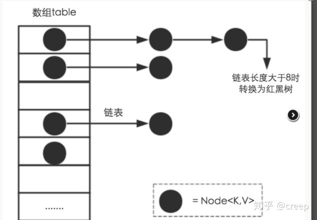

[原文链接](https://blog.csdn.net/weixin_44015043/article/details/105346187)

## HashMap的实现原理
JDK1.7中使用的数组+链表，JDK1.8中使用的数组+链表+红黑树，当链表长度大于8时，会将链表转化为红黑树。

算法过程：
1. 根据key的hashcode做散列，计算出数组内对应的下标值。
2. 如果数组中对应的位置为空，说明没有与其他元素冲突，就直接放在该位置。
3. 如果数组中对应的位置不为空，且下面是链表格式，链表长度小于8，就放到链表里（JDK1.8放在尾部，JDK1.7放在头部）；如果添加后链表长度大于8，
就将链表转化为红黑树的结构。
4. 如果数组中对应的位置不为空，且下面是红黑树格式，就将新元素插入到红黑树中。
5. 进行扩容检测，如果需要扩容，将数组进行2倍扩容，并将老数组中的所有元素取出来重新进行hash散列，再放到新数组中。



## 为什么使用数组而不是链表？
数组的查询时间复杂度是O(1)，通过散列函数计算出数组的下标，可以直接定位到节点的位置。

使用底层数组，不使用ArrayList，可以自定义扩容机制，而ArrayList是1.5倍扩容。

## 如何计算数组的下标值？
根据key取得hashcode后，将它与数组的长度减1进行与运算，得出下标值。
进行与操作时，计算只用到了最后几位，导致所生成的下标值不能够完全散列。
解决方式是将hashcode的高16位与低16位进行异或操作，得到的值再进行相与，得到最终散列的下标值。

```java
hash = (h = key.hashCode()) ^ (h >>> 16);

if ((p = tab[i = (n - 1) & hash]) == null)
    tab[i] = newNode(hash, key, value, null);
```